# PicoRV32 Optimization Project — Consolidated Phase Report

**Document purpose:** Single reference for Phases 1–5: scope, methodology, baseline definitions, quantitative results, formal status, and how the **optimized (KSA + Vedic + PCPI)** configuration compares to **Baseline A / B / C** on the iCE40 UltraPlus (UP5K) flow used in this repo.

**Primary artifact paths:** `opt/synth/reports/*.csv`, `opt/synth/reports/*summary*.txt`, `opt/formal/phase4_report.txt`, `opt/synth/reports/phase5_measure.json`.

**Raster figures (PNG):** Generated under `opt/docs/figures/` by `python3 opt/scripts/generate_report_figures.py`. Each chart is saved as **`.png`** (lossless). Regenerate after updating CSVs or `phase5_measure.json`.

| Figure (basename) | Description |
|-------------------|-------------|
| `phases_flow_overview` | Phase 1–5 pipeline diagram |
| `phases_detail_block` | Phases P1–P5 with sub-deliverables (Mermaid + PNG) |
| `phase1_lut4` | Phase 1 pre-PnR SB_LUT4 by config |
| `phase2_mul_test_cycles` | Integration `mul_test` total cycles |
| `phase2_pcpi_latency` | Average PCPI latency (cycles) |
| `phase2_switching_w1` | Switching proxy W1 |
| `phase3_lut4` | Post-flow SB_LUT4 |
| `phase3_carry` | SB_CARRY comparison |
| `phase3_fmax` | Routed Fmax (Baseline B shows PnR fail) |
| `phase5_fmax_abc2` | Phase 5 `-dsp` vs `-dsp -abc2` |
| `tradeoff_lut4_vs_pcpi_latency` | SB_LUT4 vs PCPI latency scatter (A / B / Opt) |

**Report generated from repository metrics** (Phase 3 summary timestamp on disk: 2026-05-03; Phase 5 measure JSON as committed in workspace).

---

## 1. Executive summary

| Theme | Outcome |
|--------|---------|
| **Functional RTL** | KSA adder, hierarchical Vedic multiplier tree, and `pcpi_vedic_mul` integrated with PicoRV32 fast-multiply path; simulation and lint gates clean (Phase 1–2). |
| **Multiply latency (PCPI)** | **7 cycles** effective PCPI wait (6 wait states + 1) vs **61** for Baseline A iterative shim; vs **3** for Baseline B native fast_mul shim (simulation TB). |
| **Integration throughput (proxy)** | `mul_test` style run: **~2.53× fewer cycles** than Baseline A; Baseline B remains faster per op but **does not close timing** on UP5K at this footprint. |
| **Area (post-PnR cell counts)** | Optimized uses **4653 SB_LUT4**, **155 SB_CARRY**, **2 BRAM** vs Baseline A **2086 / 424 / 4**; vs Baseline B **5036 / 461 / 4** (Baseline B **routing failed**). |
| **Peak clock (routed)** | Baseline A **27.36 MHz**, Baseline C **27.05 MHz**, Optimized **21.20 MHz** (nextpnr, seed per Phase 3 logs). Lower Fmax is the trade for a deeper arithmetic / KSA critical path at **13 logic levels** vs **37** on Baseline A. |
| **Formal (Phase 4)** | Full suite is modular (F1–F5); the **fast smoke** path used in Phase 5 waives slow legs — see §6. |
| **Synth experiment (Phase 5)** | **`-abc2`** second ABC pass: **slightly fewer LUTs**, **lower Fmax** on the same seed — not adopted as default. |

**Bottom line:** The optimized core **greatly reduces multiply latency vs iterative Baseline A** and **routes on UP5K** where Baseline B **over-utilizes LUTs**. Peak **Fmax is lower than Baseline A/C**; **dynamic switching proxy is higher** than both A and B for the exercised workloads.

---

## 2. Baseline and optimized definitions

| Config | MUL | Fast MUL | Arithmetic path | Role in report |
|--------|-----|----------|-----------------|----------------|
| **Baseline A** | ON | OFF | Iterative / stock path via shim | Slow mul reference |
| **Baseline B** | ON | ON | Native `fast_mul` via **fastshim** | Fast but **PnR failed** on UP5K |
| **Baseline C** | OFF | OFF | Core only | Area / Fmax without MUL |
| **Baseline C′** | — | — | Core + KSA (Phase 3 row) | Isolated KSA impact on timing |
| **Optimized** | ON | ON | **KSA + Vedic + `pcpi_vedic_mul`** | Target implementation |

Sources: `opt/docs/P1_Readme.md`, `opt/docs/P2_Readme.md`, `opt/synth/reports/master_metrics.csv`.

---

## 3. Phase overview (scope)

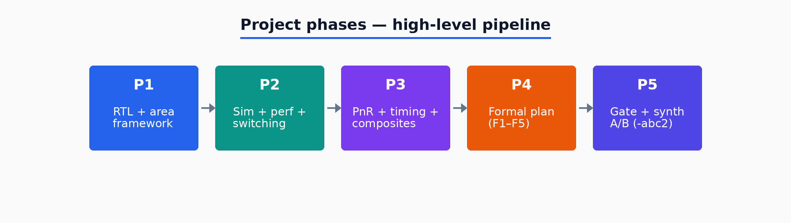

**Phase detail (always visible in preview):** same content as the Mermaid block further down. Regenerate with `python3 opt/scripts/generate_report_figures.py`.

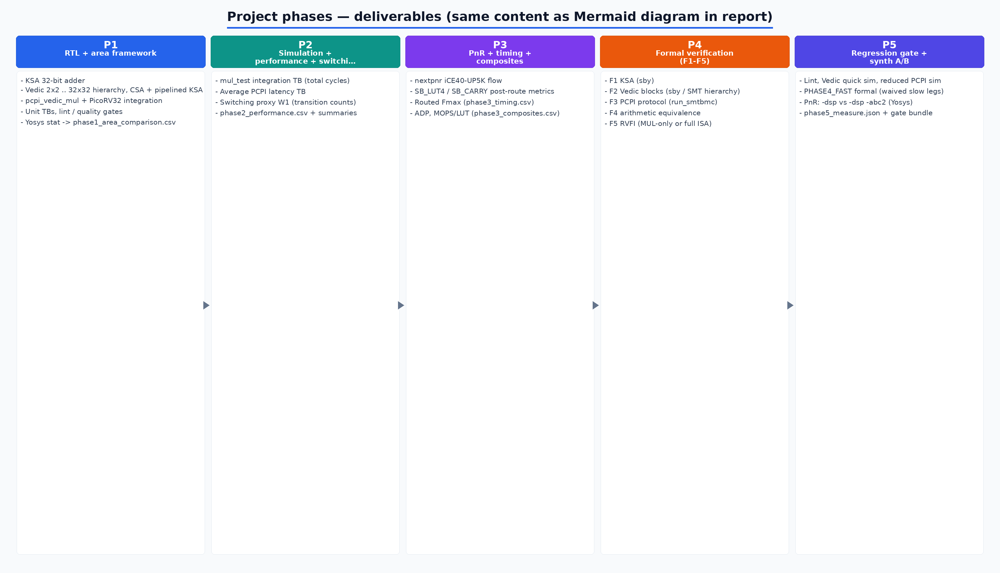

**Mermaid (editable source):** **GitHub** renders fenced Mermaid in the browser. **Cursor / VS Code** built-in Markdown preview does **not** — install **Markdown Preview Mermaid Support** (`bierner.markdown-mermaid`; recommended in `.vscode/extensions.json`), then reopen the preview.

---

## 4. Phase 1 — RTL delivery and pre-PnR area (Yosys `stat`)

**Deliverables:** KSA 32-bit adder, Vedic 2×2 → 32×32 hierarchy, CSA + pipelined KSA in multiplier, `pcpi_vedic_mul`, PicoRV32 integration, unit TBs, area comparison script output.

### 4.1 Synthesis cell totals (Phase 1 table)

| Config | TOTAL_CELLS | SB_LUT4 | SB_DFF | SB_CARRY | SB_RAM40_4K |
|--------|------------:|--------:|-------:|---------:|------------:|
| Baseline A | 3568 | 2166 | 155 | 432 | 4 |
| Baseline B | 6370 | 5132 | 217 | 439 | 4 |
| Baseline C | 2732 | 1727 | 152 | 378 | 4 |
| **Optimized** | **7349** | **5589** | **699** | **380** | **4** |

*Source:* `opt/synth/reports/phase1_area_comparison.csv` (pre-PnR `stat` — differs from Phase 3 post-techmap counts).

### 4.2 Visual — LUT share of total cells (Phase 1, illustrative)

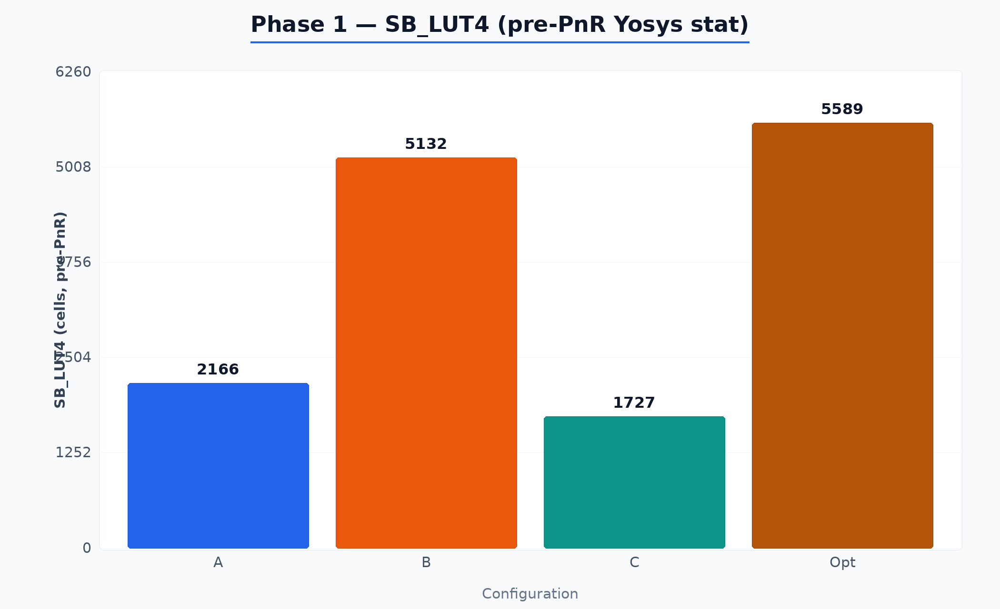

### 4.3 Quality gate (Phase 1 proxy)

| Metric | Value | Target |
|--------|------:|--------|
| Lint warnings | 0 | 0 |
| Lint errors | 0 | 0 |
| Fast-add markers | 5 | ≥ 3 |
| Module coverage proxy | 2 | ≥ 2 |
| Dead-code proxy | 0 | 0 |

*Source:* `opt/synth/reports/phase1_quality_metrics.txt`.

---

## 5. Phase 2 — Simulation, performance, switching

### 5.1 `mul_test` style integration (cycles)

| Config | total_cycles | stall_cycles | stall_% | effective_ipc |
|--------|-------------:|-------------:|--------:|--------------:|
| baseline_A_mul | 547 | 387 | 70.75 | 0.0658 |
| baseline_B_mul | 181 | 0 | 0 | 0.1989 |
| **optimized_mul** | **216** | **84** | **38.89** | **0.1667** |

**Speedup (from Phase 2 summary):** vs Baseline A mul_test **2.53×** fewer cycles; vs Baseline B **0.84×** (B still fewer cycles in this micro-benchmark).

*Sources:* `opt/synth/reports/phase2_performance.csv`, `opt/synth/reports/phase2_performance_summary.txt`.

### 5.2 Visual — `mul_test` total cycles (lower is better)

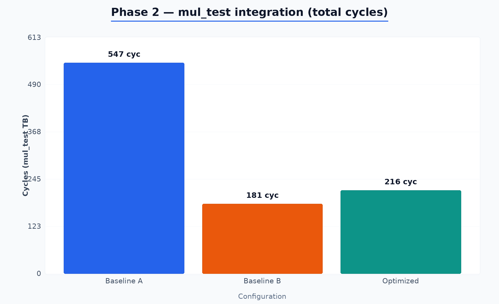

### 5.3 PCPI latency (testbench average)

| Config | avg_pcpi_latency | avg_pcpi_wait_cycles |
|--------|-----------------:|---------------------:|
| baseline_A_pcpi | 61 | — |
| baseline_B_pcpi | 3 | 0 |
| **optimized_pcpi** | **7** | **6** |

### 5.4 Visual — PCPI latency (cycles)

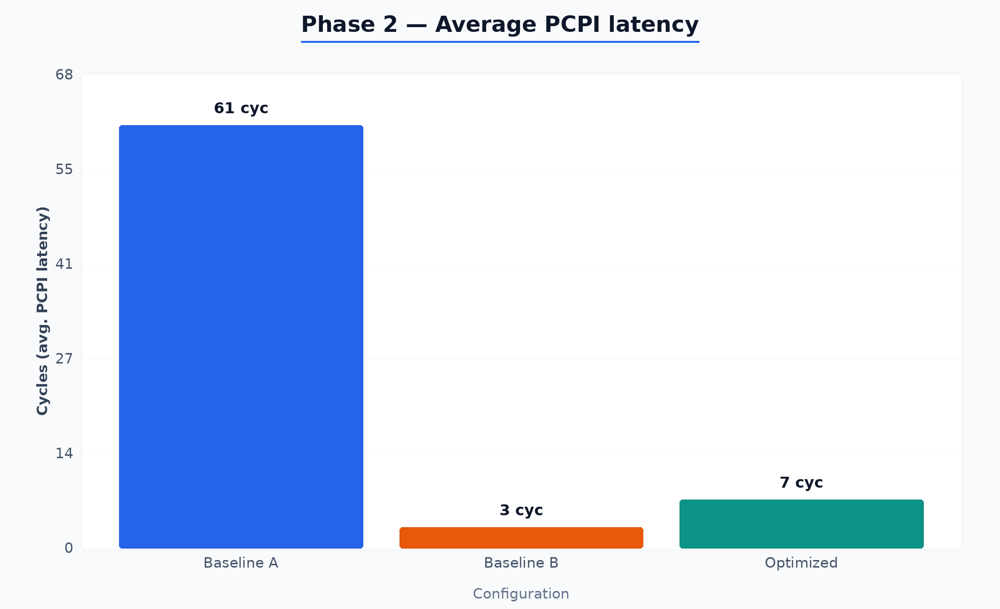

### 5.5 Switching activity proxy (dynamic power hint)

| Config | Total transitions (W1) | Cycles | Trans/cycle (W2) |
|--------|-------------------------:|-------:|------------------:|
| Baseline A | 17839 | 547 | 32.61 |
| Baseline B | 6748 | 181 | 37.28 |
| **Optimized** | **20301** | **195** | **104.11** |

Optimized shows **higher** transition count vs A (+13.8% W1) and vs B (+200.8% W1) for the captured workloads — consistent with more parallel bit activity in Vedic/KSA paths.

*Source:* `opt/synth/reports/switching_comparison.txt`.

### 5.6 Visual — switching transitions (W1)

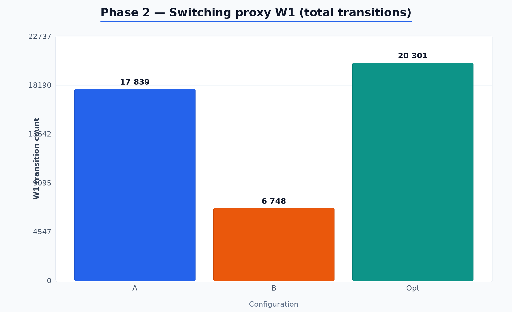

---

## 6. Phase 3 — Place & route, timing, composite KPIs

Phase 3 runs **nextpnr-ice40** (UP5K) and merges area, timing, simulation-derived MUL metrics, and switching into `master_metrics.csv` / composites.

### 6.1 Routed area (SB_LUT4, SB_CARRY, BRAM)

| Config | SB_LUT4 | SB_DFF | SB_CARRY | SB_RAM40_4K |
|--------|--------:|-------:|---------:|------------:|
| Baseline A | 2086 | 119 | 424 | 4 |
| Baseline B | 5036 | 181 | 461 | 4 |
| Baseline C | 1661 | 116 | 370 | 4 |
| Baseline C′ (KSA) | 1807 | 116 | 339 | 4 |
| **Optimized** | **4653** | **650** | **155** | **2** |

*Source:* `opt/synth/reports/phase3_area_final.csv`.

### 6.2 Visual — SB_LUT4 after PnR-related synth path

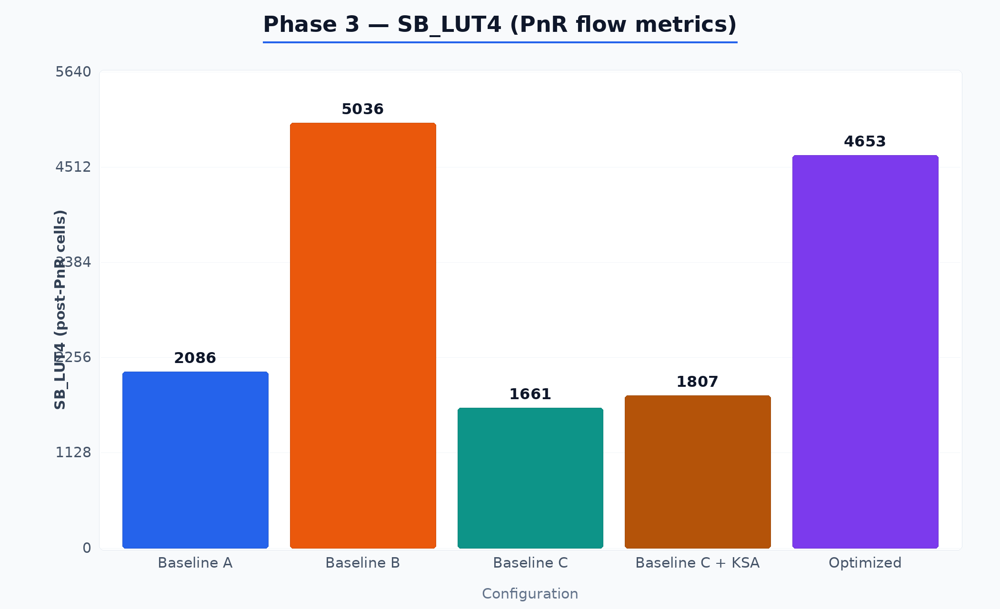

### 6.2b Visual — SB_CARRY (carry-chain pressure)

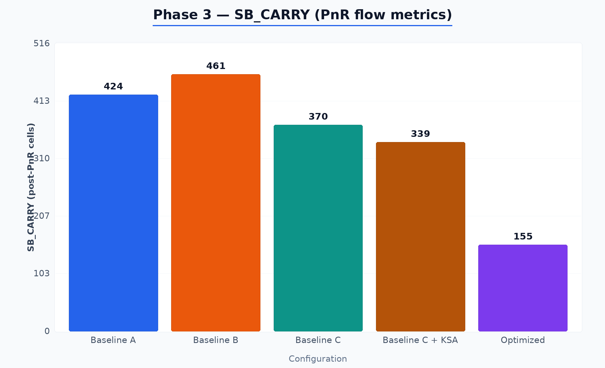

### 6.3 Routed Fmax and critical path

| Config | Fmax MHz | crit_path_ns | crit_module | logic_levels | PnR rc |
|--------|---------:|-------------:|-------------|-------------:|:------:|
| Baseline A | **27.36** | 41.0 | — | 37 | 0 |
| Baseline B | *N/A* | — | — | — | **1** (route fail) |
| Baseline C | **27.05** | 41.74 | — | 40 | 0 |
| Baseline C′ | 21.73 | 44.79 | ksa_adder | 13 | 0 |
| **Optimized** | **21.20** | 46.10 | **ksa_adder** | **13** | 0 |

Baseline B: **95.4% LUT utilization**, routing failed (documented as expected in Phase 3 summary).

*Source:* `opt/synth/reports/phase3_timing.csv`, `opt/synth/reports/phase3_report_summary.txt`.

### 6.4 Visual — achieved Fmax (MHz)

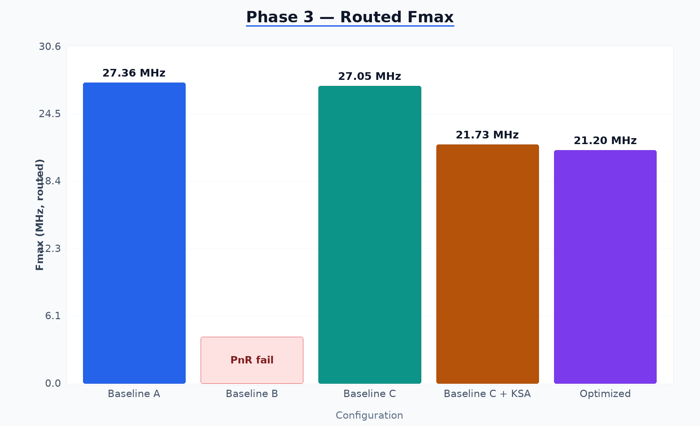

### 6.5 Composite multiply throughput (optimized)

| Metric | Optimized value | Notes |
|--------|----------------:|-------|
| cycles_per_MUL | **7** | From PCPI TB integration into composites |
| throughput_MOPS | **3.029** | Fmax / cycles_per_MUL style composite |
| E3_speedup_A | **2.532** | vs Baseline A on composite definition |
| E4_speedup_B | **0.838** | vs Baseline B |
| E5_MOPS_LUT | 0.000651 | MOPS per LUT efficiency proxy |
| E1_ADP | 214503 | Area–delay style product (repo definition) |

*Source:* `opt/synth/reports/phase3_composites.csv`.

### 6.6 Phase 3 master checklist (abridged)

| Check | Result |
|--------|--------|
| Synthesis LUT4 ≤ 5280 | PASS |
| Optimized PnR succeeded | PASS |
| Fmax ≥ 12 MHz | PASS |
| Fmax ≥ 18 MHz | PASS |
| MUL latency ≤ 4 cycles | **FAIL** (7-cycle PCPI path) |
| BRAM budget ≤ 2 | PASS |
| KSA reduced SB_CARRY vs Baseline B | PASS |

*Source:* `opt/synth/reports/phase3_report_summary.txt`.

---

## 7. Phase 4 — Formal verification

**Plan:** F1 KSA (`sby`), F2 Vedic (2×2 … 32×32 mix of `sby` / SMTBMC), F3 PCPI (`run_smtbmc`), F4 arithmetic equiv, F5 RVFI (MUL-only or full). See `opt/docs/P4_Formal_Verification_Plan.md`.

### 7.1 Latest committed fast report (waived slow legs)

This snapshot matches a **PHASE4_FAST**-style run (F3/F4/F5 omitted; large Vedic omitted):

| Leg | Status |
|-----|--------|
| F1_ksa_formal | PASS |
| F2_vedic_2x2 / 4x4 / 8x8 | PASS |
| F2_vedic_16x16 / 32x32 | WAIVED |
| F3_pcpi_protocol | WAIVED |
| F4_arithmetic_equiv | WAIVED |
| F5 RVFI | omitted |

*Source:* `opt/formal/phase4_report.txt`.

Full formal closure requires running the waived targets on sufficient wall time; the project treats them as **tracked** rather than **completed** in this report row.

---

## 8. Phase 5 — Regression gate and synthesis A/B

**Intent:** Short gate after Phase 3 metrics: **lint**, **Vedic quick sim**, **PCPI sim** (reduced random count in gate script), **PHASE4_FAST** formal, and **PnR comparison** for `optimized` vs **`optimized_abc2`** (`synth_ice40` **`-dsp -abc2`**).

### 8.1 Phase 5 PnR / synth experiment

| Variant | Fmax MHz | SB_LUT4 (synth stat) |
|---------|---------:|---------------------:|
| optimized (`-dsp`) | **21.20** | 4653 |
| optimized_abc2 (`-dsp -abc2`) | **15.94** | 4642 |

On this design and tool version, **`-abc2` did not improve Fmax**; LUT count is essentially unchanged. **`-retime`** was intentionally **not** used in the shipping script: Yosys 0.9 over-collapses the closed-memory test wrapper.

*Source:* `opt/synth/reports/phase5_measure.json`.

### 8.2 Visual — Phase 5 Fmax (same PnR constraints)

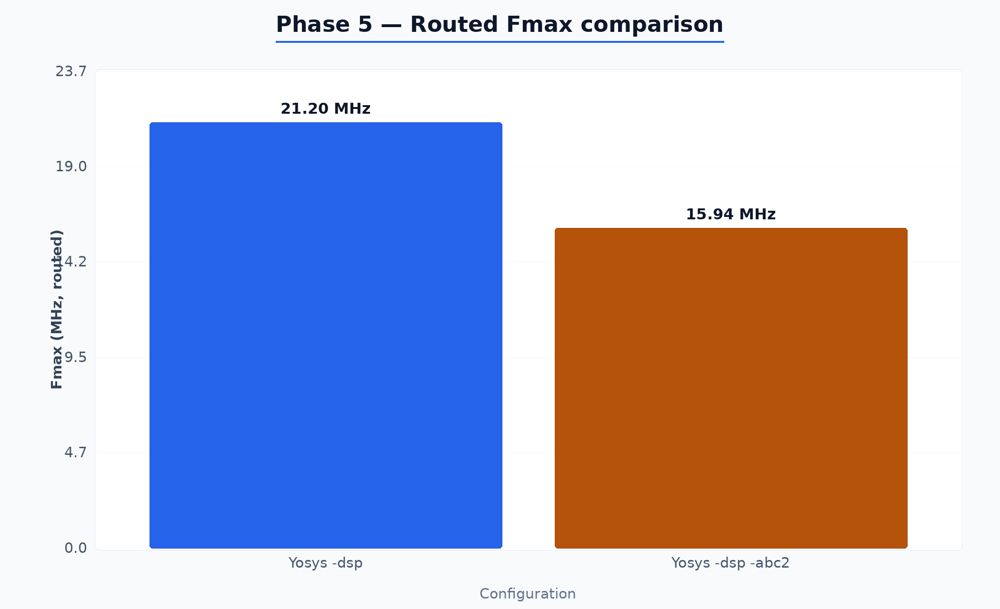

---

## 9. Trade-off diagram (SB_LUT4 vs PCPI latency)

Raster scatter from `master_metrics.csv` (Baseline A, B, Optimized): **horizontal** axis is post-flow **SB_LUT4**; **vertical** axis is **PCPI latency** in cycles (lower is faster MUL). Baseline B keeps very low latency but sits at high LUT count (and **PnR failed** on UP5K in Phase 3).

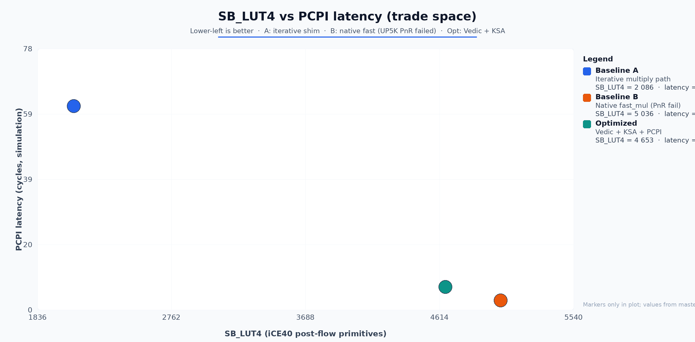

*Interpretation:* Baseline B pushes LUT utilization to the point of **routing failure**. Optimized lands as a **middle ground**: **much better than A** on multiply latency and routable at **~88% LUT**, at the cost of **lower peak Fmax** than A/C and **higher switching** than B on the measured stimulus.

---

## 10. Conclusions

1. **vs Baseline A (iterative):** The optimized Vedic + KSA + PCPI path delivers a **large reduction in multiply latency and integration cycle count**, at the cost of **more LUTs/FFs** and **lower Fmax** than the small iterative design on UP5K.
2. **vs Baseline B (native fast_mul shim):** Baseline B wins **raw cycle count** in micro-benchmarks but **fails placement/routing** on this device at captured utilization; the optimized configuration is the **practical fast-multiply** option for a **bitstream-capable** UP5K image in this repo.
3. **Carry reduction:** Optimized **SB_CARRY** is **155** vs **424** (A) and **461** (B), aligning with **KSA-heavy** addition at the expense of **LUT depth** on the critical path (`ksa_adder`).
4. **Formal:** Small-property formal passes are **green**; long-running legs remain **project risks** to schedule explicitly.
5. **Phase 5 tooling:** Automated gate + **`-abc2`** measurement is in place; results show **no Fmax gain** for `-abc2` here.

---

## 11. Appendix — key file index

| Artifact | Path |
|----------|------|
| Phase 1 area CSV | `opt/synth/reports/phase1_area_comparison.csv` |
| Phase 1 quality | `opt/synth/reports/phase1_quality_metrics.txt` |
| Phase 2 performance | `opt/synth/reports/phase2_performance.csv` |
| Phase 2 summary | `opt/synth/reports/phase2_performance_summary.txt` |
| Switching compare | `opt/synth/reports/switching_comparison.txt` |
| Phase 3 area / timing / composites | `opt/synth/reports/phase3_area_final.csv`, `phase3_timing.csv`, `phase3_composites.csv` |
| Phase 3 narrative | `opt/synth/reports/phase3_report_summary.txt` |
| Master rollup | `opt/synth/reports/master_metrics.csv` |
| Phase 4 report | `opt/formal/phase4_report.txt` |
| Phase 5 measure | `opt/synth/reports/phase5_measure.json` |
| Phase 5 gate bundle | `opt/synth/reports/phase5_complete.txt` |
| Phase docs | `opt/docs/P1_Readme.md`, `P2_Readme.md`, `P4_Formal_Verification_Plan.md`, `P3_Hardware_Prototyping_Plan.md`, `P5_RVFI_Formal.md` |
| Report figures (PNG) | `opt/docs/figures/*.png` |
| Figure generator | `opt/scripts/generate_report_figures.py` |

---

*End of consolidated report.*
